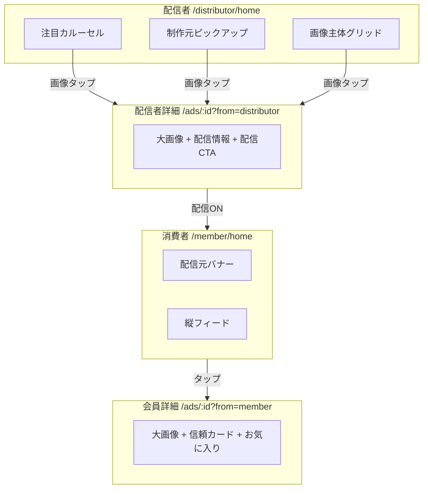

# 4画面 Flutter 組み込み計画

HTMLモック（`docs/html-mockups/`）を現行 Flutter モックに段階的に取り込む計画です。**mock のまま**、読み込みが遅くならないことを前提にしています。

## 対象画面

| # | 画面 | HTML | Flutter ルート | 現状 |
|---|------|------|----------------|------|
| 1 | 作成元ダッシュボード | `advertiser.html` | `/advertiser/home` | 統計カード・レポート・セクション分割済み |
| 2 | 配信判断画面 | `distributor-pick.html` | `/distributor/home` | 画像主体グリッド・ピックアップ済み |
| 2b | **配信者広告詳細** | `distributor-detail.html` | `/ads/:id?from=distributor` | **画像タップ遷移・配信CTA 済み** |
| 3 | 消費者フィード | `consumer.html` | `/member/home` | スマホ:縦フィード / PC:カテゴリ+グリッド |
| 4 | 消費者詳細 | `consumer-detail.html` | `/ads/:id?from=member` | `MemberAdDetailBody` 済み |

## 配信判断 → 詳細遷移（画面2b）

配信判断画面では、**画像・キャッチコピーをタップして広告詳細を開く**流れを標準とします。ステータスボタン（配信中 / 未配信）は一覧上での即時切り替え用、詳細画面では確認ダイアログ付きで配信操作します。

### ユーザー操作フロー

```
注目カルーセル / 制作元ピックアップ / 配信候補グリッド
  → 画像またはキャッチコピーをタップ
  → /ads/:id?from=distributor（広告詳細）
  → 下部「配信する / 配信停止」で最終判断
```

### Flutter 実装（済み）

| 要素 | 実装 |
|------|------|
| グリッドカード | `AdCardDistributorVisual` — 画像に「詳細を見る」オーバーレイ、`onTap` で `context.push` |
| 制作元ピックアップ | `PastAdvertiserPickupCarousel` — 同上 |
| 注目カルーセル | `FeaturedAdsCarousel` + `linkFrom: 'distributor'` |
| 詳細画面 | `AdDetailPage` — `from=distributor` 時に配信情報・料金表示、下部 CTA |
| 配信確認 | `confirmToggleDistributing`（`lib/screens/distributor/distributor_actions.dart`）を一覧・詳細で共有 |

### HTML 実装（済み）

- `distributor-pick.html` — `.va-image-link` / キャッチコピーリンク → `distributor-detail.html?id=…`
- `distributor-detail.html` — 配信者向け詳細（大画像・配信情報・下部配信ボタン）

## 基本方針

```
docs/html-mockups/          →  lib/widgets/ideal/
  distributor-pick.html     →  DistributorBrowseLayout + AdCardDistributorVisual
  distributor-detail.html   →  AdDetailPage（from=distributor 分岐）
  consumer.html             →  ConsumerFeedLayout
  consumer-detail.html      →  MemberAdDetailBody
```

- 既存 `AppShell` / `OperatorShell` / `go_router` は維持
- データは `ad_repository` + `mock_data`
- `AppColors`（`#1565C0` 等）は既存テーマを流用

## 画面別残タスク

### 画面1：作成元ダッシュボード

- [x] `AdvertiserDashboardLayout` + `StatsGrid`
- [x] `home_advertiser_page.dart` 差し替え

### 画面2：配信判断（仕上げ）

- [x] 画像主体グリッド `AdCardDistributorVisual`
- [x] 制作元ピックアップ
- [x] 画像タップ → 詳細遷移
- [x] モバイル `MemberFilterBar` 最終確認

### 画面3：消費者フィード

- [x] `ConsumerFeedLayout` + `FeedAdCard` + `DistributorBanner`
- [x] `home_member_page.dart` 差し替え

### 画面4：消費者詳細

- [x] `MemberAdDetailBody` 抽出（大画像・信頼カード・電話 CTA）

## パフォーマンス設計

| 施策 | 内容 |
|------|------|
| ローディング局所化 | グリッドのみ `DemoAsyncWrapper`（300ms・初回のみ） |
| キャッシュキー分離 | `distributor-home-grid` 等 |
| リスト遅延構築 | 消費者は `ListView.builder` |
| カルーセル上限 | ピックアップ・注目は最大 8 件 |
| RepaintBoundary | カード単位で維持 |

## 実装フェーズ（推奨順）

```
Phase 0（0.5日） ideal_theme.dart 基盤

Phase 1（1日） 消費者フィード ← 差分最大

Phase 2（0.5日） 消費者詳細

Phase 3（1日） 作成元ダッシュボード

Phase 4（0.5日） 配信判断仕上げ
  ├─ 画像主体グリッド（済）
  ├─ 画像タップ → 詳細（済）
  └─ モバイルフィルタ確認

Phase 5（0.5日） お気に入り画面・テスト・UI_ROLES.md 更新
```

## 画面間の関係


