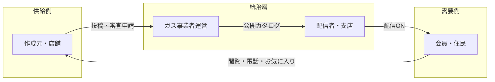
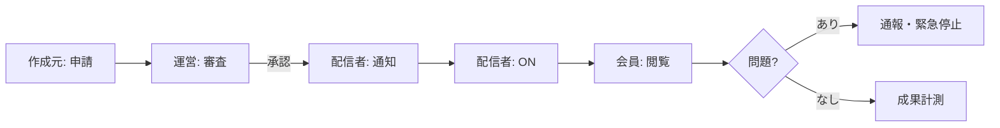

# カリルネ プラットフォーム調査・設計リサーチ

運営画面・ユーザー画面の整備に向けた選考事例の収集・分析。  
カリルネモック（Flutter + `mock_data`）の現状と照合し、今後の実装優先度を示す。

**関連ドキュメント**

| ファイル | 内容 |
|----------|------|
| [UI_ROLES.md](./UI_ROLES.md) | ロール別 UI 分担（実装準拠） |
| [MOCK_BRUSHUP.md](./MOCK_BRUSHUP.md) | デモシナリオ・ブラッシュアップ済み項目 |
| [ADMIN_OPERATOR_PLAN.md](./ADMIN_OPERATOR_PLAN.md) | 運営・編集画面の改修計画 |
| [html-mockups/index.html](./html-mockups/index.html) | HTML あるべき姿モック |
| `deep-research-report.md`（外部調査） | 統治型プラットフォームの機能要件（本書に統合） |

**最終更新:** 2026-06-26

---

## 1. エグゼクティブサマリー

カリルネは Google / Meta 型の**純粋な広告ネットワーク**ではなく、**地域事業者の正当性を運営が確認し、配信者（支店）が選別し、会員に説明責任を伴って届ける「統治型の地域広告プラットフォーム」**として設計するのが自然である（[deep-research-report](../deep-research-report.md) より）。

先行事例を横断すると、配信面の最適化より先に整備されるのは次の7層である。

1. 参加者管理（広告主確認・RBAC）
2. ポリシー審査（掲載可否・差戻し・再審査）
3. 配信統制（地域・カテゴリ・枠・期間）
4. 計測・レポート
5. 透明性と説明責任
6. 金流と精算
7. 品質・不正対策

**カリルネの現状:** 会員・配信者・作成元の**閲覧・判断 UI**は地域ポータル型事例と整合している。一方、運営の**コントロールタワー**（審査操作・一覧・監査ログ・精算）はモック段階であり、ここへの投資が最優先である。

---

## 2. プロダクトポジショニング

### 2.1 カリルネのエコシステム



HTML モックの表現: **作成元（広告を作る）→ 配信者（選んで届ける）→ 消費者（信頼して行動する）**

### 2.2 比較するべき3系統

| 系統 | 代表 | カリルネとの関係 |
|------|------|------------------|
| **A. 大手広告プラットフォーム** | Google Ads, Meta Ads, LINEヤフー広告, Apple Ads, Amazon Ads | 統治機能（審査・権限・請求・透明性）の参照元。**配信最適化は後段** |
| **B. パブリッシャー / SSP** | AdKit, Teqblaze, Ads Interactive | 配信者・運営の「要対応キュー」「在庫管理」の参照 |
| **C. 地域ポータル / メディア** | iタウンページ, まいぷれ, スマイルタウン, AreaCamp | 会員向け**信頼・発見・行動導線**の参照。**カリルネに最も近い体験層** |

カリルネは **A の統治 + C の会員体験 + 独自の三層構造（運営・支店・会員）** のハイブリッドである。

### 2.3 統治型である理由

大手プラットフォームの公式資料を横断すると、配信そのものより先に以下が土台として存在する。

- 広告主確認（Google Advertiser Verification）
- 広告審査（Google / Meta 公開前審査、公開後再審査）
- 権限管理（Manager Account, Business Asset, campaign group ロール）
- 請求・精算（Billing Summary, Stripe Connect marketplace）
- 透明性（Ads Transparency Center, Ad Library, “Why am I seeing this ad?”）
- 通報・再審査・緊急停止

地域住民の生活インフラ（ガス事業者）が媒介する以上、**「誰を載せるか」の責任**は配信ロジックと同じ重さを持つ。

---

## 3. プラットフォーマー機能の7レイヤー

（[deep-research-report](../deep-research-report.md) §「プラットフォーマーの中核は配信機能ではなく統治機能」より整理）

| レイヤー | 何を管理するか | 先行事例 | カリルネへの訳し方 |
|----------|----------------|----------|-------------------|
| **参加者管理** | 広告主・運営・配信者・閲覧者の資格と権限 | Google 広告主確認、アカウント停止。Apple Ads の Account Admin / Finance / Read Only。Amazon Ads の Admin / Editor / Viewer | 事業者確認、支店所属確認、運営のみ審査・掲載枠操作、招待・承認履歴 |
| **ポリシー審査** | 掲載可否、差戻し、却下、再審査 | Google: 作成・編集で自動審査（おおむね1営業日）。Meta: 通常24時間程度、公開後再審査あり。LINEヤフー: 一覧で審査状況確認 | `下書き → 申請中 → 承認 → 配信可 → 配信中 → 停止 → 終了 → 却下/差戻し` を明文化。差戻し理由必須 |
| **配信統制** | 誰がどの面に出せるか | Google / Apple のキャンペーン階層と権限 | 配信可能支店、対象県・カテゴリ、注目枠可否、掲載期間を運営が定義 |
| **計測・レポート** | 表示・クリック・電話・オフライン成果 | Google: Web / App / Phone / Offline conversion。Meta: Ads Reporting 共有・スケジュール | 最低限: 表示、詳細遷移、電話タップ、お気に入り、配信者別・地域別成果 |
| **透明性** | 誰の広告か、なぜ出たか、通報 | Google: Why this ad, Transparency Center。Meta: Ad Library, Info and Ads | 会員に「○○ガスのおすすめ」、掲載事業者、通報。運営は掲載アーカイブ |
| **金流・精算** | 請求、入金、返金、按分、税 | Google Billing、Stripe Connect onboarding / payout | 広告主請求、本部取り分、支店配分、返金、請求書、消費税 |
| **品質・不正** | IVT、偽装、ブランドセーフティ | IAB ads.txt、JIAA IVT ガイドライン、JICDAQ 掲載品質認証 | 重複投稿、虚偽店舗、不自然クリック、期限切れ露出の検知・停止 |

---

## 4. 選考事例カタログ

### 4.1 大手広告プラットフォーム（統治・運営）

#### Google Ads

| 項目 | 内容 | 参照 |
|------|------|------|
| 広告主確認 | 段階的ロールアウト。未完了でアカウント停止の可能性。確認情報は Ads Transparency Center に公開 | [Advertiser verification](https://support.google.com/adspolicy/answer/9703665) |
| 透明性 | 広告主名・所在地・支払者名を開示。2025年以降 payer name の手動編集可 | [Verification tasks](https://support.google.com/adspolicy/answer/15577076) |
| 管理構造 | Manager Account で複数アカウント横断の報告・アクセス・請求・アラート | 社内運用ダッシュボード事例（madoguchi ads）と同型 |
| 変更履歴 | Change history で「誰が何を変えたか」を追跡 | 運営監査ログの要件根拠 |
| 計測 | Website / App / Phone call / Offline conversion を並列管理 | カリルネは Phone + 詳細遷移を優先 |

#### Meta Ads

| 項目 | 内容 |
|------|------|
| 審査 | Advertising Standards に基づく全広告審査。Business verification |
| 制限 | 広告単体ではなく Business Account / 資産単位で制限可能 |
| 透明性 | Ad Library、「Why am I seeing this ad?」、通報導線 |
| リスク | 2025年報道: 詐欺・禁止商品の流通、認定パートナー関与 — **審査・パートナー管理・緊急停止の重要性** |

#### LINEヤフー広告

| 項目 | 内容 | 参照 |
|------|------|------|
| 一覧画面 | ツリー構造（キャンペーン→広告グループ）、実績グラフ、設定一覧 | [管理ツール構成](https://ads-help.yahoo-net.jp/s/article/H000044407) |
| 操作 | 配信 ON/OFF、インライン編集、一括操作、ラベル、審査状況確認 | 配信者画面の標準 UI |
| 階層 | キャンペーン → 広告グループ → 広告（LINE広告から移行後も同構造） | [移行ガイド note](https://note.com/mare_adsupport/n/n1f24f136f89b) |

#### Apple Ads / Amazon Ads

| 項目 | 内容 |
|------|------|
| Apple | Account Admin / Finance / Read Only + **campaign group 単位**の制限ロール |
| Amazon | Admin / Editor / Viewer 系の権限分離、downloadable reports |

**共通教訓:** プラットフォーム本体は「広告を配る」より「広告取引と掲載資格を統治する」コントロールプレーンが先にある。

---

### 4.2 広告運用ダッシュボード（作成元・代理店・運営）

#### madoguchi ads（国内事例）

- URL: https://ads.madoguchi.inc/
- **情報階層:** オーバービュー → サービス別パフォーマンス → 日別トレンド → 媒体別シェア
- **要対応アラート**を独立ゾーン化（予算・停止推奨等）
- キャンペーン別のインライン操作（停止/再開、入札調整）
- 運営メモ、自動最適化ルール、監査レポート連携

**カリルネへの示唆:** 運営画面最上段は KPI より **要対応キュー**（審査待ち、配信0、通報未処理）。

#### LocalFolio ダッシュボード（β）

- URL: https://syncad.jp/news/news_localfolio/
- 広告主・代理店が **自社パフォーマンスをいつでも確認**
- 媒体横断ではなく **自社に関係する数値に絞る**

**カリルネへの示唆:** 作成元ダッシュボードは他社比較より **自社広告の状態と成果** に集中（現行 `StatsGrid` + ミニ統計は妥当）。

#### CA Dashboard / Databeat 連携

- 複数媒体フォーマットを統合し Looker Studio 等で可視化
- 日次レポート提供、CSV エクスポート

**カリルネへの示唆:** 本番フェーズで月次 CSV・期間比較を追加。モック段階では不要。

---

### 4.3 パブリッシャー / 配信者向け

#### AdKit Publisher Dashboard

- URL: https://docs.adkit.dev/publisher/dashboard
- 上部 **5 KPI**（Revenue, Impressions, Clicks, CTR）
- **Suggested items:** 保留予約・期限切れ枠など **要アクションを優先表示**
- Live activity（直近5イベント）

**カリルネへの示唆:** 配信者右パネル「過去の実績」に加え、**「今日やること」**（未配信おすすめ、終了間近、審査通過新作）を上部に。

#### Ads Interactive PUI v4.0

- URL: https://adsinteractive.com/blog/unveiling-the-new-publisher-user-interface-pui/
- タイル数を削減し **本当に必要な指標のみ** に再設計
- ウィジェット型レポート、視覚化強化

#### Teqblaze SSP リデザイン

- URL: https://teqblaze.com/blog/white-label-ssp-ad-exchange-redesign
- **グローバル管理者 → 会社管理者 → パブリッシャー/アドバタイザー** の階層権限
- ロールごとに見える分析画面を分離
- 在庫・取引を単一画面で比較

#### Peppernode / Optima（開発事例）

- URL: https://peppernode.co/cases/custom-analytics-dashboard-for-advertising-operations/
- RBAC: Admin / Finance / Media Buyer / Partner
- 役割に不要なデータは非表示 → 認知負荷とセキュリティの両立

---

### 4.4 地域ポータル型（会員向け体験）

| 事例 | URL | 会員向けの強み | 広告主向けの強み |
|------|-----|----------------|------------------|
| **iタウンページ** | https://www.ntt-tp.co.jp/service/itp.html | 店舗情報・地図・カテゴリ検索 | 検索上位表示、リスティングプラン、EC/予約オプション |
| **まいぷれ** | https://www.kebo.jp/service/mypltoyama/ | 地元スタッフ監修の記事、信頼感 | ローカル検索、MEO連携、年10万円以内の参入 |
| **スマイルタウン** | https://smiletown.info/advertisers/ | 全国検索可能な地域密着 | 店舗ページ + バナー枠、SEO |
| **AreaCamp** | https://fastview.jp/landing/areacamp/function | 検索・カテゴリ・バナー枠 | **サイト内各種広告枠設定**、店舗管理画面、PWA通知 |
| **軽井沢ナビ**（AreaCamp運用） | https://www.b-breaks.com/service-detail04/ | 地域ナビとしての信頼 | 安価な店舗専用ページ |

**地域ポータル共通パターン**

```
発見（カテゴリ・地域・キーワード）
  ↓
信頼（運営者による掲載・「誰がおすすめしているか」）
  ↓
行動（電話・地図・詳細・予約）
  ↓
広告主価値（店舗ページ + 上位表示 + バナー枠）
```

**カリルネとの対応**

| 地域ポータル要素 | カリルネ実装 |
|------------------|-------------|
| 運営による掲載 | 審査ワークフロー（モデルあり、UI 未実装） |
| 誰のおすすめか | `DistributorBanner`、FeedAdCard の from-line |
| カテゴリ・地域 | `BrowseHomeLayout` サイドバー |
| 行動導線 | 電話（mock SnackBar）、詳細、お気に入り |
| 注目枠 | `FeaturedAdsCarousel` + `/admin/featured-placements` |

---

### 4.5 広告システム原型・審査 UI

#### WeChat 広告管理原型（PMAI）

- URL: https://www.pm-ai.cn/share/detail/prototype/944373
- 広告一覧: ID、送信先、内容、提出日時、**ステータス**
- コンテンツ審査、ユーザー管理を運営画面に集約

**カリルネへの示唆:** `AdPublicationStatus` と運営の審査キュー UI を接続する。

---

## 5. ダッシュボード vs 管理パネル

[SaaS Admin Panel 設計原則](https://taqwah.agency/blog/saas-admin-panel-design-guide) より:

| 種類 | 目的 | 主な UI | カリルネでの画面 |
|------|------|---------|------------------|
| **ダッシュボード** | 状況の可視化 | KPI カード、グラフ | 運営概要、作成元 StatsGrid、配信者実績パネル |
| **管理パネル** | 状態の変更 | テーブル、フォーム、承認ボタン | 審査、掲載枠、配信 ON/OFF、広告編集 |

**設計原則**

- 1画面に詰め込みすぎない
- 情報階層: **要対応 → KPI → 一覧 → 詳細**（madoguchi / LINEヤフー / AdKit で共通）
- KPI は **3〜5個** が上限（Ads Interactive がタイル削減した理由と同型）
- ロールごとに **同じ粒度の情報を見せない**

---

## 6. ロール別 画面・操作・KPI 設計

（[deep-research-report](../deep-research-report.md) §「ロール別に持つべき画面と操作」+ 事例調査より統合）

### 6.1 会員（`/member/*`）

| 観点 | 内容 |
|------|------|
| **第一目的** | 安心して見て、すぐ行動できる |
| **必須要素** | 誰のおすすめか（`DistributorBanner`）、掲載事業者名、電話・詳細・お気に入り |
| **追加推奨** | 掲載理由の一文、通報導線（Google/Meta 型） |
| **不要** | CTR、審査ログ、入札情報 |

**現行実装:** `ConsumerFeedLayout` / `MemberDesktopHome` + `FeedAdCard` — **地域ポータル事例と整合**

| 画面 | 実装 | ギャップ |
|------|------|----------|
| ホーム | FeedAdCard、注目カルーセル | 通報・「なぜ表示」の明示 |
| 詳細 | `MemberAdDetailBody`、電話 CTA | 通報 |
| お気に入り | `FavoriteAdCard` | 小 |

---

### 6.2 配信者（`/distributor/*`）

| 観点 | 内容 |
|------|------|
| **第一目的** | 何を今日 ON にするかを素早く決める |
| **必須要素** | 画像主体一覧、配信 ON/OFF、カテゴリ・地域、終了間近、新着、支店実績 |
| **追加推奨** | 要対応サマリー（未配信おすすめ、審査通過新作） |
| **不要** | クリエイティブ編集、請求設定、全体審査権限 |

**現行実装:** `DistributorBrowseLayout` + `AdCardDistributorVisual` + 実績パネル

| 画面 | 実装 | ギャップ |
|------|------|----------|
| ホーム | 注目・ピックアップ・画像グリッド | 「今日やること」帯 |
| 詳細 | 料金・オプション非表示済み | — |
| お気に入り・履歴 | Visual カード統一済み | — |

---

### 6.3 作成元（`/advertiser/*`）

| 観点 | 内容 |
|------|------|
| **第一目的** | 原稿を出し、審査状態と成果を把握する |
| **必須要素** | 原稿状態、差戻し理由、配信中/終了、配信者数、表示・電話、再申請 |
| **追加推奨** | 投稿プレビュー（`FeedAdCard`）、セクション分け（下書き/審査中/配信中） |
| **不要** | 全支店在庫、会員個人データ、他社比較 |

**現行実装:** `AdvertiserDashboardLayout` + `AdCardAdvertiser` ミニ統計 + 編集2ステップ

| 画面 | 実装 | ギャップ |
|------|------|----------|
| ダッシュボード | StatsGrid 4枚 | 審査状態別セクション |
| 投稿 | 5ステップ（新規）、2ステップ（編集） | プレビュー |
| 詳細 | 料金・オプション表示 | 作成元向けは妥当 |

---

### 6.4 運営（`/admin/*`）

| 観点 | 内容 |
|------|------|
| **第一目的** | 事故なく回し、例外を潰し、収益を閉じる |
| **必須要素** | 要対応キュー、審査一覧、差戻し、RBAC、変更履歴、通報、緊急停止 |
| **追加推奨** | 請求・未収、広告主確認、監査ログ |
| **不要** | 会員向けの軽い演出 |

**現行実装:** `/admin/dashboard`（KPI・要対応・シナリオ・審査待ち一覧）、`/admin/featured-placements`

| 機能 | 実装 | ギャップ |
|------|------|----------|
| KPI 概要 | `adminDashboardStatsProvider` | 審査 SLA、通報率など運営 KPI |
| 要対応 | 審査待ち・下書きアラート | 配信0、通報未処理、請求未発行 |
| 審査操作 | 一覧表示のみ | **承認/却下/差戻し UI** |
| 掲載枠 | featured-placements | — |
| 監査 | なし | change history 相当 |

---

## 7. 運営コントロールタワー — 具体機能要件

（[deep-research-report](../deep-research-report.md) §「カリルネ型で特に重要な運営機能」）

運営画面は **KPI ダッシュボード** より **コントロールタワー** であるべき。最上段の指標例:

- 審査待ち件数
- 審査 SLA 超過
- 配信 0 件の承認済み広告
- 同一素材の多重投稿
- 配信者未割当
- 通報未処理
- 請求未発行 / 未収

### 7.1 運営機能マトリクス

| 運営機能 | 必須理由 | 具体要件 |
|----------|----------|----------|
| 参加者オンボーディング | なりすまし・責任所在不明の防止 | 事業者確認、担当者確認、支店所属、書類、停止理由履歴 |
| 資産カタログ管理 | 配信者画面が単なる一覧化しないため | 業種、地域、期間、使用面、注目枠、クリエイティブ仕様 |
| 審査と再審査 | Google/Meta 標準 | 審査キュー、却下理由テンプレ、差戻し、再申請、SLA、担当アサイン、監査ログ |
| 配信権限管理 | 事故と認知負荷の低減 | 支店=配信 ON/OFF のみ、運営=審査・枠、作成元=原稿編集のみ |
| 例外処理・サポート | 審査長期化・通報 | 問い合わせケース、異議申し立て、緊急停止、担当引継ぎ |
| 支払い・精算 | 収益化の前提 | 請求、回収、支店配分、返金、請求書、税、未収アラート |

### 7.2 推奨画面構成（運営）

```
┌─────────────────────────────────────────────────┐
│ 要対応キュー（審査・通報・配信0・未収・異常）      │
├─────────────────────────────────────────────────┤
│ KPI 4〜6（登録/配信中/会員表示/参照/審査待ち/未収）│
├──────────────────────┬──────────────────────────┤
│ 審査キュー（操作可）   │ 注目掲載・デモシナリオ      │
├──────────────────────┴──────────────────────────┤
│ 広告一覧（検索・フィルタ・ステータス・一括操作）    │
├─────────────────────────────────────────────────┤
│ 変更履歴・監査ログ（誰が・いつ・何を）             │
└─────────────────────────────────────────────────┘
```

### 7.3 業務導線（優先するワークフロー）

全自動最適化より先に、人手を正しく繋ぐキュー設計が重要:



---

## 8. データガバナンス・収益・品質

（[deep-research-report](../deep-research-report.md) §「データガバナンスと収益オペレーション」）

### 8.1 個人情報・外部送信

- 会員の閲覧・お気に入り・電話タップを蓄積するほど、**利用目的の明示**が必要
- 外部送信規律（Cookie 等）への配慮
- カリルネ規模でも、利用規約・プライバシーポリシー・オプトアウト設計は本番前に必須

### 8.2 計測サーフェス（段階導入）

| 段階 | イベント |
|------|----------|
| **MVP（現行 mock）** | 表示（viewCount）、詳細遷移、電話タップ（mock）、お気に入り |
| **Phase 2** | 配信者別・地域別集計、期間比較 |
| **Phase 3** | 地図遷移、クーポン、来店報告、オフライン取込 |

Google は Phone call conversion を公式サポート。地域店舗送客では **電話・来店** が Web CTR と同じくらい重要。

### 8.3 収益オペレーション

後付けすると破綻しやすい領域。イベント設計だけでも初期から切っておく:

- 広告主請求（掲載開始・オプション・期間延長）
- ガス事業者本部取り分
- 支店インセンティブ
- 掲載停止時の精算・返金
- 請求書・領収書・消費税区分

参照: [Google Ads Billing](https://support.google.com/google-ads/answer/1703648)、[Stripe Connect](https://stripe.com/connect)

### 8.4 品質・不正（軽量版）

プログラマティック フルセットは不要。カリルネで監視すべき項目:

| 検知対象 | 対応 |
|----------|------|
| 重複広告・同一素材多重投稿 | 運営アラート |
| 虚偽店舗・なりすまし | 事業者確認 + 審査 |
| 不自然クリック・電話 | 簡易閾値（将来） |
| 期限切れなのに露出継続 | `isActive` + 自動非表示 |
| 不適切カテゴリ | 審査 + 通報 |

参照: [IAB ads.txt](https://iabtechlab.com/ads-txt/)、JIAA IVT ガイドライン、JICDAQ 掲載品質認証

---

## 9. カリルネ現状ギャップ分析

### 9.1 実装済み（強み）

| 領域 | 内容 |
|------|------|
| 会員体験 | `DistributorBanner` + `FeedAdCard` + 電話/詳細/お気に入り |
| 配信判断 | 画像主体 `AdCardDistributorVisual`、共有確認フロー |
| 作成元 | StatsGrid、ミニ統計、編集2ステップ |
| 運営（v1） | KPI、要対応アラート、審査待ち一覧、シナリオ切替 |
| データモデル | `AdPublicationStatus`、`toggleDistributing` → `memberAdsProvider` |
| デモ | S1〜S4 シナリオ、エンドツーエンド説明可能 |

### 9.2 ギャップ一覧

| 領域 | 事例標準 | カリルネ | ギャップ度 |
|------|----------|----------|-----------|
| 会員透明性 | 理由表示・通報 | 掲載理由・通報 mock 対応済み | 小 |
| 配信者 | 要対応優先 | 「今日やること」帯 + 実績パネル | 小 |
| 作成元 | 状態別セクション・差戻し理由 | セクション分け・再申請・プレビュー対応済み | 小 |
| 運営審査 | 承認/却下/差戻し | 審査キュー UI 対応済み | — |
| 運営一覧 | 検索・一括操作 | `/admin/ads` 検索・フィルタ・緊急停止対応済み | 小 |
| RBAC | 階層権限 | デモ用ロール切替 + 運営バッジ | 本番 |
| 監査ログ | change history | in-memory 監査ログ対応済み | 小 |
| 精算 | billing events | イベント設計プレビュー（mock） | 本番 |
| レポート | CSV・期間比較 | 軽量 CSV エクスポート対応済み | 中 |

### 9.3 モデルと UI の対応

| モデル / Provider | ある機能 | UI で未接続 |
|-------------------|----------|-------------|
| `AdPublicationStatus` | draft / pendingReview / published / rejected | —（審査操作接続済み） |
| `toggleDistributing` | 配信者 ↔ 会員フィード | —（接続済み） |
| `adminDashboardStatsProvider` | 集計 | 審査 SLA 等（本番） |
| `featured_placements` | 掲載枠 CRUD | —（接続済み） |

---

## 10. 整備ロードマップ（優先度）

（[deep-research-report](../deep-research-report.md) §「優先度の高い整備提言」+ 本調査を統合）

| 優先度 | 施策 | 理由 | 参照事例 |
|--------|------|------|----------|
| **P0** | 運営コントロールタワー拡張 | 審査・通報・配信0を一画面で。後続機能の前提 | Google review / change history |
| **P0** | 審査ワークフロー UI | 承認・却下・差戻し・理由・再申請 | Google/Meta/LINEヤフー |
| **P1** | RBAC + 監査ログ | 三層構造では誤操作が最大リスク | Apple roles, Google access |
| **P1** | 配信者「今日やること」 | 価値は分析より判断速度 | AdKit suggested items |
| **P1** | 請求イベント設計 | 収益化開始時に後付け不可 | Google billing, Stripe Connect |
| **P2** | 会員透明性（通報・理由） | 地域キュレーションの信頼根幹 | Google Why this ad, Meta |
| **P2** | 作成元状態別 UI + プレビュー | 差戻し連携 | LocalFolio |
| **P2** | 軽量レポート CSV | 月次運用 | Meta/Amazon export |
| **P3** | 推薦・自動最適化 | 実績蓄積後 | Google Recommendations |

### Phase 対応（既存計画との関係）

| 既存 Phase | 本リサーチでの位置づけ |
|------------|----------------------|
| [ADMIN_OPERATOR_PLAN](./ADMIN_OPERATOR_PLAN.md) Phase 3〜4 運営 | P0〜P2 の mock 対応完了 |
| [MOCK_BRUSHUP](./MOCK_BRUSHUP.md) | 会員・配信者の UI 統一 — P2 以前に完了 |
| 本番認証・実決済 | P1 請求イベントと並行 |

---

## 11. 画面設計テンプレート（目標像）

### 11.1 会員ホーム

```
DistributorBanner（誰のおすすめか）
  ↓
FeaturedAdsCarousel（運営キュレーション）
  ↓
カテゴリ / 地域フィルタ
  ↓
FeedAdCard × N（電話・詳細・お気に入り）
  ↓
[将来] 通報・掲載理由
```

### 11.2 配信者ホーム

```
[将来] 今日やること（新着・終了間近・未配信おすすめ）
  ↓
注目カルーセル
  ↓
制作元ピックアップ
  ↓
配信候補グリッド（画像 + ON/OFF）
  ↓
実績パネル（3〜5 KPI）
```

### 11.3 作成元ダッシュボード

```
StatsGrid（4 KPI）
  ↓
[将来] 下書き / 審査中 / 配信中 / 終了 セクション
  ↓
AdCardAdvertiser（ミニ統計 + 編集）
```

---

## 12. 結論

1. **カリルネは「統治型地域広告プラットフォーム」** — 配信最適化型ネットワークではない。
2. **会員・配信者・作成元の画面骨格は事例と整合** — 特に `DistributorBanner` と画像主体配信判断は差別化要素。
3. **最大ギャップは運営のコントロールタワー** — 審査操作、広告一覧、監査ログ、要対応キューの拡張。
4. **実装優先度** — 華やかなレポートより、**申請 → 審査 → 配信可 → 支店 ON → 会員閲覧 → 問題時停止** の業務導線を切れ目なくすること。
5. **本番前に設計だけ入れるべき** — RBAC、請求イベント、個人情報・通報、品質監視の最小セット。

---

## 13. 参考文献・リンク集

### 公式・ヘルプ

- [Google Ads Advertiser Verification](https://support.google.com/adspolicy/answer/9703665)
- [Google Ads Verification Tasks](https://support.google.com/adspolicy/answer/15577076)
- [LINEヤフー広告 管理ツール構成](https://ads-help.yahoo-net.jp/s/article/H000044407)
- [AdKit Publisher Dashboard Docs](https://docs.adkit.dev/publisher/dashboard)

### 国内サービス・事例

- [madoguchi ads](https://ads.madoguchi.inc/) — 広告運用ダッシュボード
- [LocalFolio ダッシュボード β](https://syncad.jp/news/news_localfolio/)
- [iタウンページ](https://www.ntt-tp.co.jp/service/itp.html)
- [まいぷれ富山](https://www.kebo.jp/service/mypltoyama/)
- [スマイルタウン 広告掲載](https://smiletown.info/advertisers/)
- [AreaCamp 機能一覧](https://fastview.jp/landing/areacamp/function)

### プラットフォーム・UX

- [Teqblaze SSP リデザイン](https://teqblaze.com/blog/white-label-ssp-ad-exchange-redesign)
- [Ads Interactive PUI v4.0](https://adsinteractive.com/blog/unveiling-the-new-publisher-user-interface-pui/)
- [Peppernode Optima 事例](https://peppernode.co/cases/custom-analytics-dashboard-for-advertising-operations/)
- [SaaS Admin Panel vs Dashboard](https://taqwah.agency/blog/saas-admin-panel-design-guide)
- [Databeat 広告ダッシュボード選び方](https://www.data-be.at/magazine/ad-dashboard-tools/)

### 原型・参考 UI

- [WeChat 広告管理原型（PMAI）](https://www.pm-ai.cn/share/detail/prototype/944373)
- [カリルネ HTML モック](./html-mockups/index.html)

### 内部調査ソース

- `deep-research-report.md`（`/Users/satouryuuichi/Downloads/deep-research-report.md`）— 統治型プラットフォーム機能要件の深掘り調査。本書 §3, §6, §7, §8, §10 に統合済み。

---

## 付録 A: 広告状態遷移（推奨モデル）

```
draft ──申請──► pendingReview ──承認──► published ──配信者ON──► distributing
                  │                    │
                  │差戻し              │期日経過
                  ▼                    ▼
                draft              ended
                  │
                  └──却下──► rejected
```

運営・作成元・配信者の各画面は、この状態に応じて **表示する操作を変える**（作成元: 編集可/不可、配信者: ON 可/不可、運営: 審査可/不可）。

---

## 付録 B: ロール別 KPI 一覧

| ロール | 見せる KPI | 見せない KPI |
|--------|-----------|-------------|
| 会員 | — | すべて |
| 作成元 | 表示、詳細、電話、お気に入り、残日数、配信者数 | 他社比較、全会員データ |
| 配信者 | 広告数、配信者数、参照数（支店実績） | 請求、全体審査 |
| 運営 | 審査リードタイム、差戻し率、通報率、配信ゼロ率、支店稼働率、未収額、緊急停止件数 | — |
